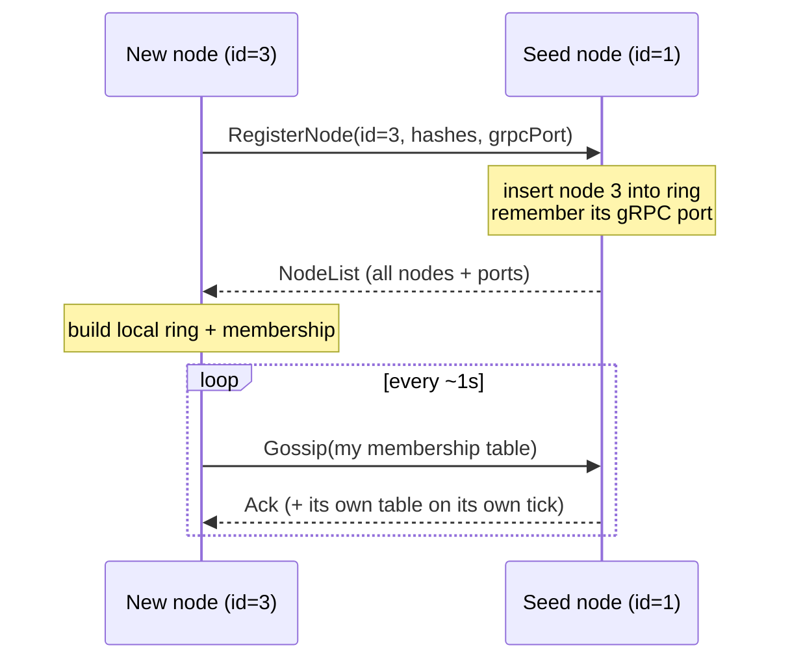
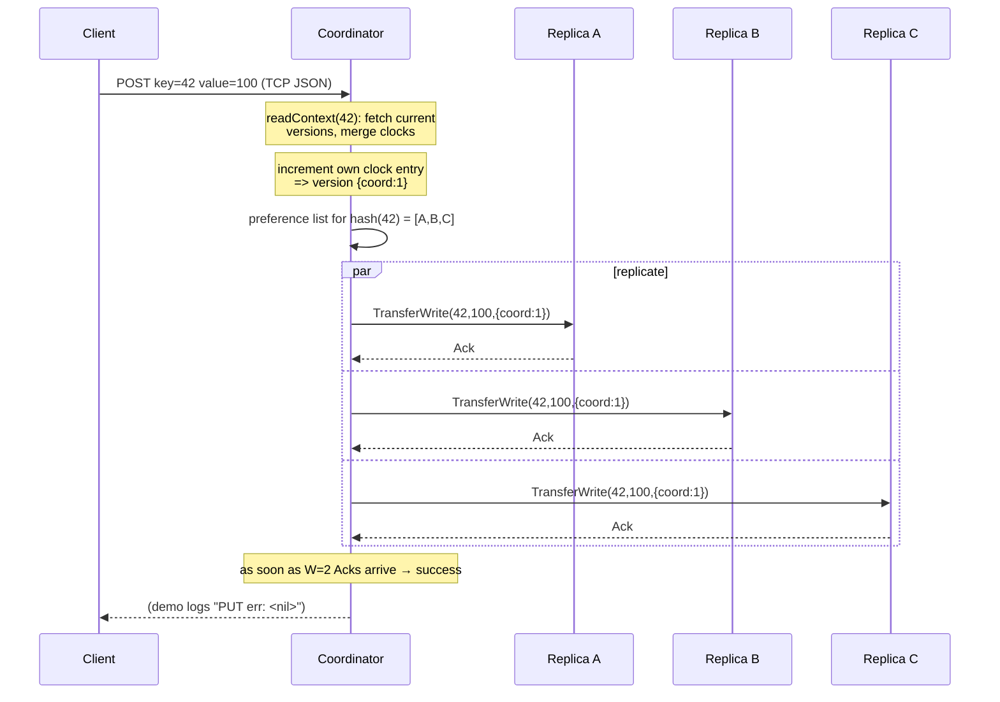
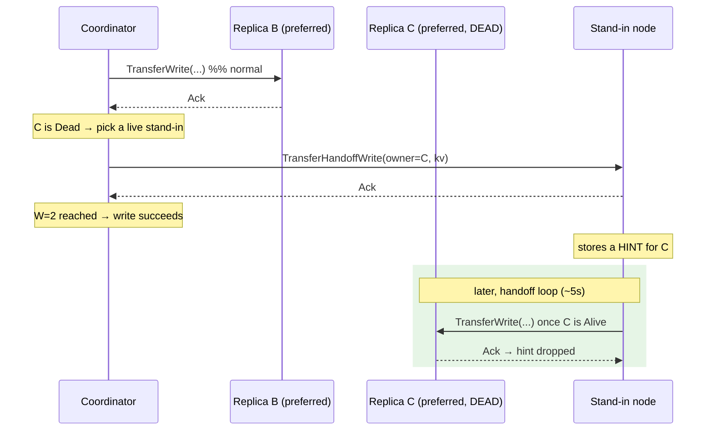
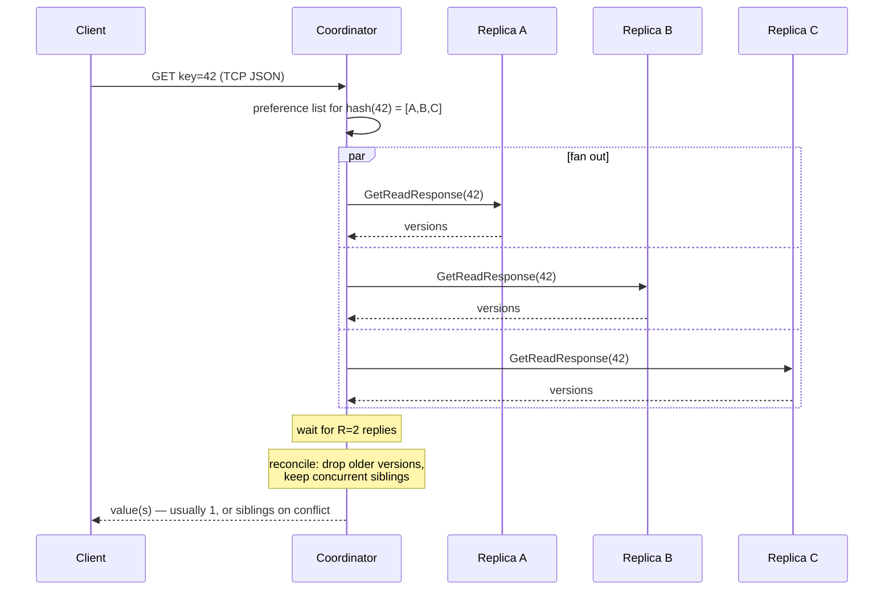
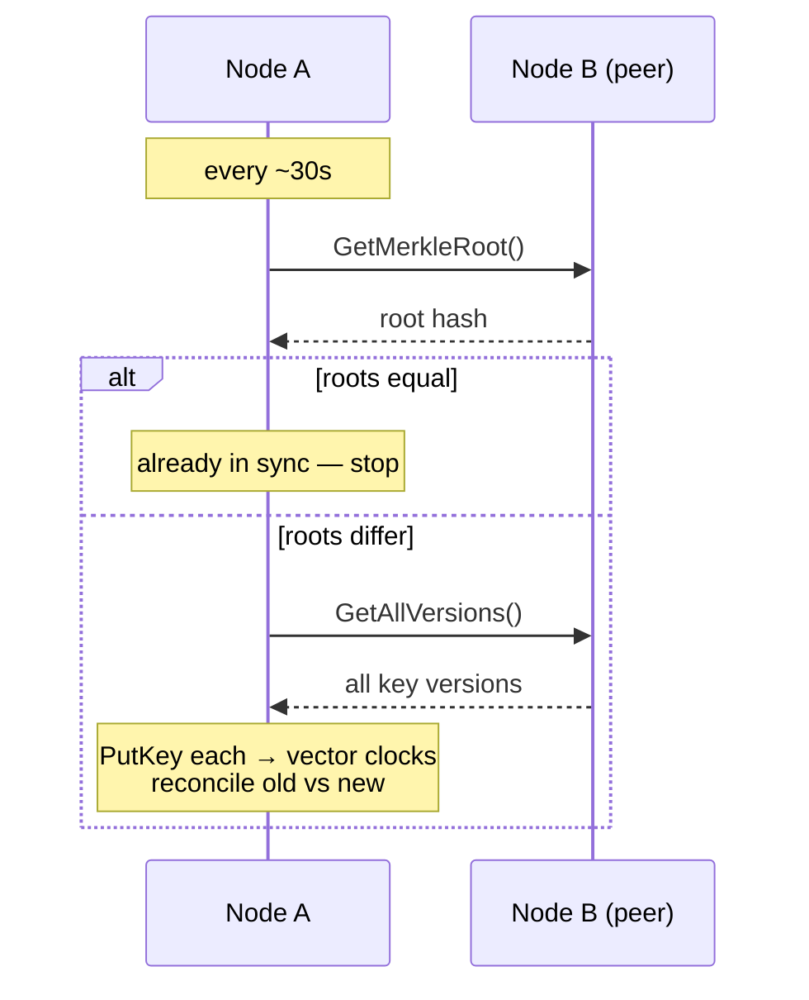
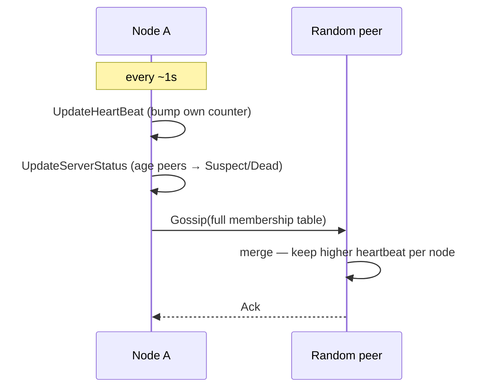

# API & Request Flows

This document walks through every request path with sequence diagrams. N=3,
R=2, W=2 throughout.

## 1. Node join / discovery

A new node registers with a **seed** node to learn the ring and everyone's gRPC
ports. After that, gossip keeps the view fresh.

Code: `grpc.go RegisterNode`, `server.go NewServer` (non-seed branch), `gossip.go`.

## 2. PUT (write) — the quorum path

Code: `tcp.go` → `replication.go CoordinatePut` → `sendWrite` → `TransferWrite`.

## 3. PUT during a failure — sloppy quorum + hinted handoff

If a preferred replica is Dead, the coordinator routes that write to a live
**stand-in** node, tagged with the intended owner. The stand-in keeps it as a
*hint*.

Code: `CoordinatePut` (the `hintedFor` branch) → `sendHinted` → `TransferHandoffWrite`; recovery in `ReplayHints`.

## 4. GET (read) — quorum + sibling reconciliation

Code: `replication.go CoordinateGet` → `sendRead` → `GetReadResponse`; merge in `reconcileVersions`.

## 5. Anti-entropy (Merkle) — background repair

Code: `AntiEntropyRound`, `buildMerkleTree`, `GetMerkleRoot`, `GetAllVersions`.

## 6. Gossip — membership + failure detection

Code: `runGossipLoop`, `UpdateHeartBeat`, `UpdateServerStatus`, `SendGossip`, `UpdateFromIncomingMemberShip`.

## Message reference (`pkg/proto/kv.proto`)

| Service | RPC | Purpose |
|---|---|---|
| `NodeDiscoveryService` | `RegisterNode` | join the cluster via a seed |
| `ReplicationService` | `TransferWrite` | store a version on a replica |
| | `GetReadResponse` | read all versions of a key |
| | `TransferHandoffWrite` | store a hint for a down node |
| | `GetMerkleRoot` | anti-entropy: compare data fingerprints |
| | `GetAllVersions` | anti-entropy: pull data to reconcile |
| `GossipService` | `Gossip` | exchange membership tables |
