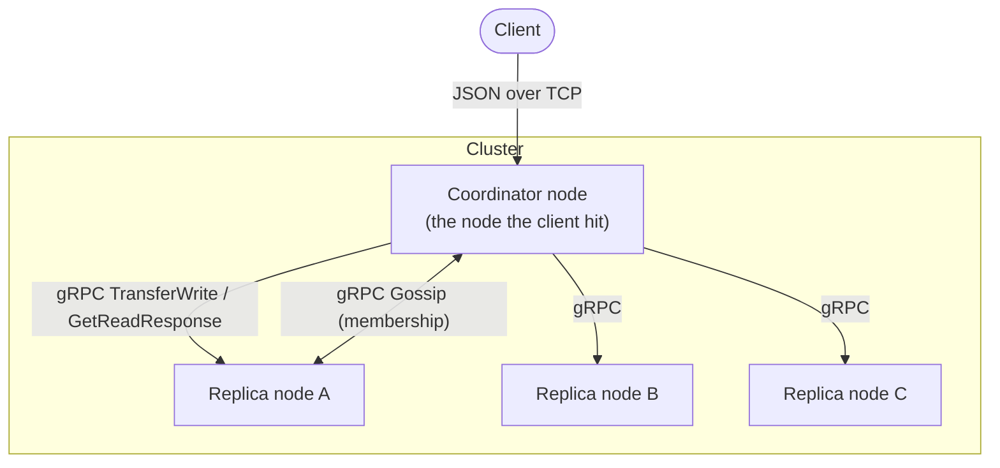
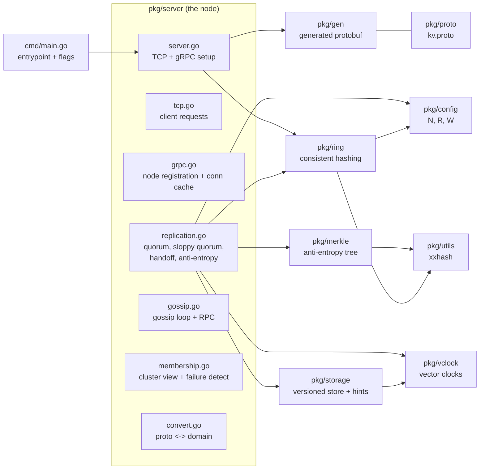
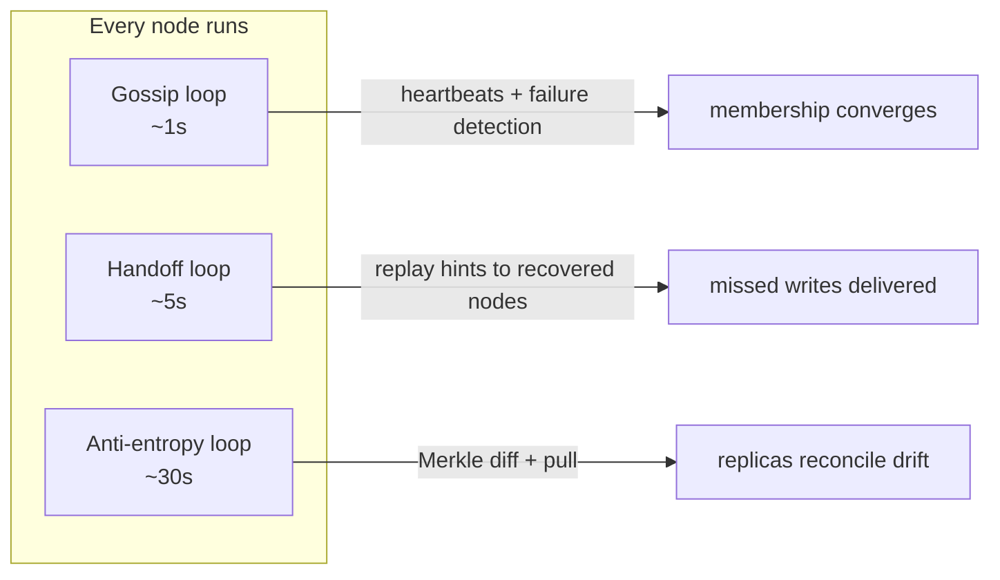

# Architecture

This is a distributed key-value store modelled on the **Amazon Dynamo** paper.
Every node is an identical Go process that talks to clients over TCP and to
other nodes over gRPC. There is no leader — all nodes are peers.

## The big picture

A client sends a request to **any** node. That node becomes the *coordinator*
for the request: it uses the consistent-hash ring to find which N nodes own the
key (the *preference list*), then talks to them over gRPC to satisfy the read or
write quorum.

## Packages

| Package | Responsibility | Key types / functions |
|---|---|---|
| `pkg/config` | System constants: replication factor **N=3**, read quorum **R=2**, write quorum **W=2** (R+W>N). | `GetSystemConfig()` |
| `pkg/utils` | Hashing keys and node names onto the ring with xxhash. | `GenerateNewRingHash(name)` |
| `pkg/vclock` | Vector clocks: causality + conflict detection. | `Increment`, `Descends`, `Concurrent`, `Merge` |
| `pkg/storage` | In-memory, **versioned** store. One key can hold multiple sibling versions. Also holds hinted-handoff buffers. | `PutKey`, `GetKey`, `AddHandoffItem`, `DrainHints` |
| `pkg/merkle` | Merkle (hash) tree to find which keys two replicas disagree on. | `New`, `Root`, `Diff`, `LeafHash` |
| `pkg/ring` | Consistent hashing with virtual nodes; builds the preference list. | `GetPreferenceListForKey`, `GetNextServerId` |
| `pkg/proto` / `pkg/gen` | gRPC service + message definitions and generated code. | `ReplicationService`, `GossipService`, `NodeDiscoveryService` |
| `pkg/server` | The node itself: client TCP server, inter-node gRPC server, and all the distributed logic. | `Server`, `CoordinatePut`, `CoordinateGet` |

## The three background loops (the paper's safety nets)

Each node runs three goroutines (`server.go` `Run`), each an independent way for
the cluster to heal:

| Loop | Interval | What it does | Code |
|---|---|---|---|
| Gossip | ~1s | Bumps own heartbeat, ages out silent peers (Alive→Suspect→Dead), sends the whole membership table to one random peer, merges what it receives. | `runGossipLoop`, `SendGossip`, `Gossip` |
| Hinted handoff | ~5s | For every peer that is Alive again, drains the hints stored for it and forwards them. | `runHandoffLoop`, `ReplayHints` |
| Anti-entropy | ~30s | Compares Merkle roots with a peer; on mismatch, pulls the peer's versions and reconciles them locally. | `runAntiEntropyLoop`, `AntiEntropyRound` |

## Design choices worth knowing

- **Coordinator-based writes.** The node that receives the write increments the
  vector clock once, then replicates the *finished* version. Replicas store it
  verbatim, so the clock never double-counts.
- **Availability over consistency (AP).** Writes succeed as long as **W** nodes
  (any W, not necessarily the "right" ones) ack — this is the *sloppy quorum*.
  Conflicts are kept as siblings and resolved on read, not rejected on write.
- **Everything is in memory.** There is no disk persistence — this is a learning
  implementation focused on the distributed algorithms, not durability.
- **Keys and values are `int`.** Kept simple on purpose; each value carries a
  vector clock so versioning still works exactly as the paper describes.
